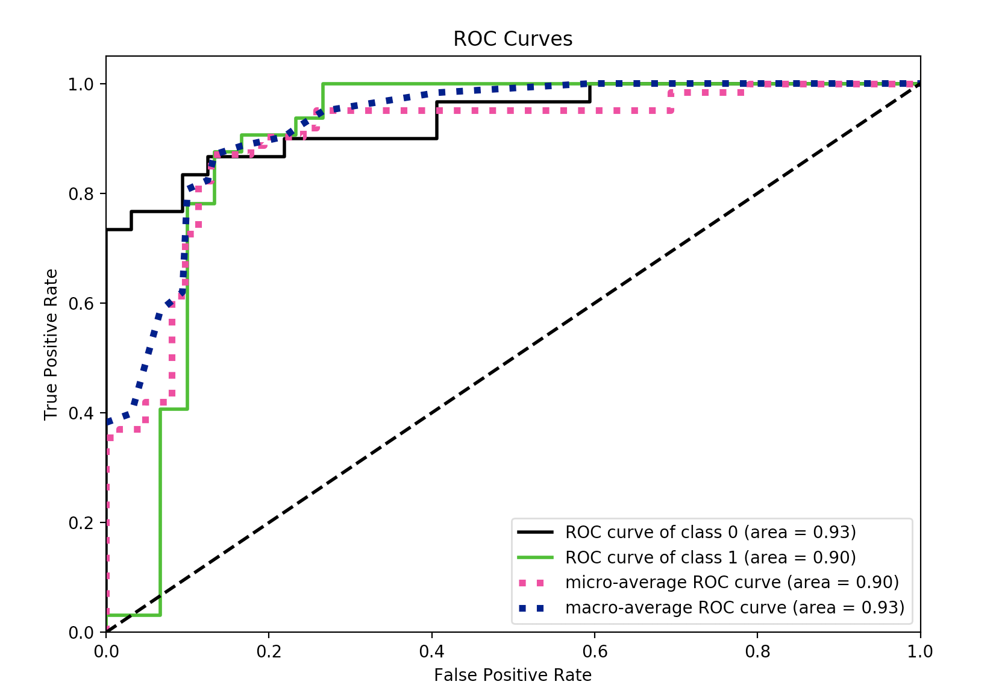

# Covid19-Classification
This project aims to classify whether the patient is covid-19 based on clinical notes of patients' chest X-ray or CT images.

## Modeling
### Experiment 1: pre-trained BERT + fine tuning
#### 1) 

After deduplication (clinical notes) by 03-27-2020:

| Covid-19 | None-Covid-19 | Total |
| --- | --- | --- | 
| 92 | 14 | 106 |

Since label bias, manually constructed 27 extra fake None-Covid-19 cases.

| Covid-19 | None-Covid-19 | Total |
| --- | --- | --- | 
| 92 | 41 | 133 |

| | Covid-19 | None-Covid-19 | Total |
| ---| --- | --- | --- | 
| Training | 72 | 26 | 98 |
| Testing | 20 | 15 | 35 |

| | True(label) | False(label) | 
| ---| --- | --- | 
| True(pred) | TP=20 | FP=8 | 
| False(pred) | FN=0 | TN=7 | 

    Precision = 20 / (20+8) = 0.71

    Recall = 20 / (20 + 0) = 1

    F1 = 0.83

#### 2) 

After deduplication (clinical notes) by 03-27-2020:

| Covid-19 | None-Covid-19 | Total |
| --- | --- | --- | 
| 92 | 14 | 106 |

Since label bias, manually copy 4 times of 14 original None-Covid-19 cases to get totally 70 None-Covid-19 cases.

| Covid-19 | None-Covid-19 | Total |
| --- | --- | --- | 
| 92 | 70 | 162 |

| | Covid-19 | None-Covid-19 | Total |
| ---| --- | --- | --- | 
| Training | 72 | 56 | 128 |
| Testing | 20 | 14 | 34 |

| | True(label) | False(label) | 
| ---| --- | --- | 
| True(pred) | TP=18 | FP=0 | 
| False(pred) | FN=2 | TN=14 | 

    Precision = 18 / (18+0) = 1

    Recall = 18 / (18 + 2) = 0.9

    F1 = 0.94

#### 3) 

Model Training Parameter Setting:

MAX_SEQ_LENGTH = 256

TRAIN_BATCH_SIZE = 10

EVAL_BATCH_SIZE = 5

LEARNING_RATE = 2e-5

NUM_TRAIN_EPOCHS = 10

RANDOM_SEED = 42

GRADIENT_ACCUMULATION_STEPS = 1

WARMUP_PROPORTION = 0.1

After deduplication (clinical notes) by 03-28-2020:

| Covid-19 | None-Covid-19 | Total |
| --- | --- | --- | 
| 104 | 37 | 141 |

| | Covid-19 | None-Covid-19 | Total |
| ---| --- | --- | --- | 
| Training | 83 | 22 | 105 |
| Testing | 21 | 15 | 36 |

| | True(label) | False(label) | 
| ---| --- | --- | 
| True(pred) | TP=19 | FP=10 | 
| False(pred) | FN=2 | TN=5 | 

    Precision = 19 / (19+10) = 0.66

    Recall = 19 / (19 + 2) = 0.9

    F1 = 0.76

#### 4) 

Same training and test dataset with Experiment 3):

Model Training Parameter Setting:

MAX_SEQ_LENGTH = 256

TRAIN_BATCH_SIZE = 7

EVAL_BATCH_SIZE = 4

LEARNING_RATE = 2e-5

NUM_TRAIN_EPOCHS = 15

RANDOM_SEED = 42

GRADIENT_ACCUMULATION_STEPS = 1

WARMUP_PROPORTION = 0.1

| | True(label) | False(label) | 
| ---| --- | --- | 
| True(pred) | TP=18 | FP=8 | 
| False(pred) | FN=3 | TN=7 | 

    Precision = 18 / (18+8) = 0.69

    Recall = 18 / (18 + 3) = 0.85

    F1 = 0.76

#### 6) final one (removing indicated keywords (COVID-19, SARS,MSERS) from dadaset)

| | Covid-19 | None-Covid-19 |
| ---| --- | --- | 
| Training | 128 | 128 | 
| Testing | 32 | 30 |

Model Training Parameter Setting:

MAX_SEQ_LENGTH = 256

TRAIN_BATCH_SIZE = 7

EVAL_BATCH_SIZE = 4

LEARNING_RATE = 2e-5

NUM_TRAIN_EPOCHS = 15

RANDOM_SEED = 42

GRADIENT_ACCUMULATION_STEPS = 1

WARMUP_PROPORTION = 0.1

| | True(label) | False(label) | 
| ---| --- | --- | 
| True(pred) | TP=28 | FP=4 | 
| False(pred) | FN=4 | TN=26 | 

    Precision = 28 / (28+4) = 0.875

    Recall = 28 / (28 + 4) = 0.875

    F1 = 0.875

